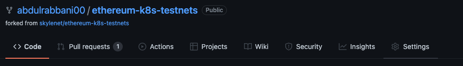
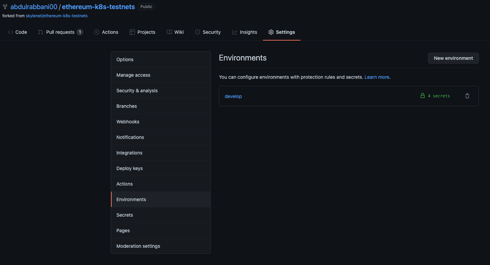
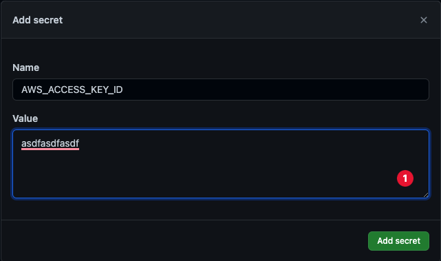
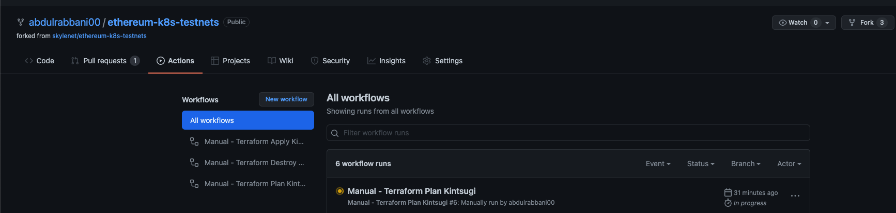
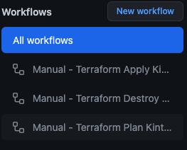
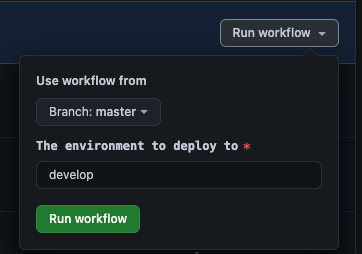
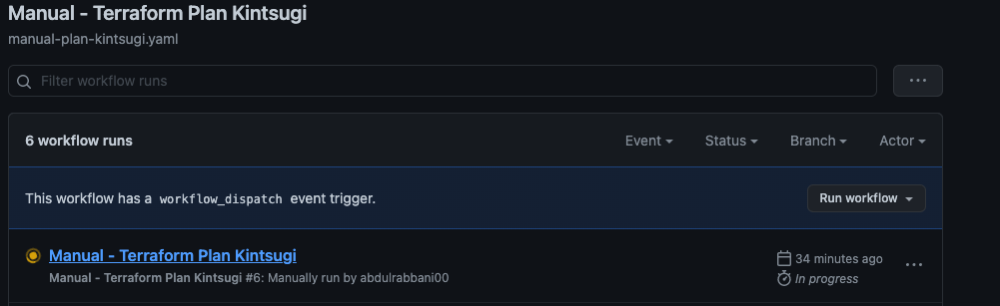

# Overview

This document will go over the steps needed to create a new environment using Terraform. With this approach, you can create multiple concurrent, independent, and customizable environments. This document will go through the setup and the steps to run the code.

# Steps

## 1. Create Config

To create your environment, you must create custom configuration files. Follow the steps below:

1.  Navigate to the start point: `cd public-merge-kintsugi/terraform/`

2.  Run the `create_env.sh` script. This script will set up the foundation for you environment: `./create_env.sh {env_name}`

    1.  **IMPORTANT:** The environment name used here will be used down the road in the CI/CD pipeline. Keep it consistent; we will refer to it as the **master environment name** for this documentation.

3.  Navigate to your new directory: `cd env/{env_name}/`

4.  Optional - Update any values in the configuration file: `{env}.tfvars`

5.  Optional - Set up a remote state. Currently, the current setup utilizes S3 and DynamoDB. Feel free to use whatever you like, or disregard the remote state.

    1.  Update the necessary values in the `backend_example.tf` file.

    2.  Rename the file: `mv backend_example.tf backend.tf`

6.  **Future Work -** Integrate Helmsman configuration into this process.


## 2. Running Code Locally


1.  Optional - Export AWS Variables

    1.  If you store the Terraform state remotely, you will need to export the following:
```
export AWS_ACCESS_KEY_ID="asdfasdfasdf"
export AWS_SECRET_ACCESS_KEY="asdfasdfasdf"
export AWS_DEFAULT_REGION="asdfasdf"
```

2.  Initialize Terraform - `terraform init`

3.  Run the Terraform Plan - `terraform plan --var do_token="asdfasdf" --var-file={env}.tfvars`

    1.  `do_token` - This is the `DIGITALOCEAN_ACCESS_TOKEN`; you will have to create one on the Digital Ocean console.

4.  Run the Terraform Apply - `terraform apply --var do_token="asdfasdf" --var-file={env}.tfvars`

5.  Run the Terraform Destroy - `terraform destroy --var do_token="asdfasdf" --var-file={env}.tfvars`


## 3. Utilizing the CI/CD pipeline

Instead of running the code locally, you can use a CI/CD pipeline. To do this, you will have to complete step 1. You will also have to create a remote backend. If you decide to use a different backend than AWS, you will have to update the CI/CD pipeline to reflect your changes. Keep track of the **master environment name.**

1.  Fork the current repository.

2.  Navigate to the `Settings` in the right corner of your fork:

    

3.  Click on the `Environment` button:

    

4.  Click on the `New environment` button. Insert the **master environment name.**

5.  Click the `Add Secret` button, add the following secrets:

    

    1.  `AWS_ACCESS_KEY_ID` - Your AWS access key ID

    2.  `AWS_DEFAULT_REGION` - Your AWS default region

    3.  `AWS_SECRET_ACCESS_KEY` - Your AWS access secret key

    4.  `DIGITALOCEAN_ACCESS_TOKEN` - Your Digital Ocean Access Token.

6.  Navigate to the `Actions` tab

    

7.  Run the Terraform Plan job. Click the `Manual - Terraform Plan Kintsugi` workflow.

    

    1.  Click `Run Workflow`, insert your **master environment name.**

        

    2.  Refresh the page, and click the new output job. The console output can be seen here.

        

8.  Run the Terraform Apply job. Click the `Manual - Terraform Apply Kintsugi` workflow.

    

    1.  Click `New Workflow`, insert your **master environment name.**

        

    2.  Refresh the page, and click the new output job. The console output can be seen here.

        

9.  When you are ready to destroy your infrastructure run the Terraform Apply job. Click the `Manual - Terraform Destroy Kintsugi` workflow. **Important -** The destroy might not _fully work_ if Digital Ocean has set your VPC as `default`.

    

    1.  Click `New Workflow`, insert your **master environment name.**

        

    2.  Refresh the page, and click the new output job. The console output can be seen here.

        


# Future Work

To improve the CI/CD pipeline, let’s consider doing the following:

1.  Integrating Helmsman into the CI/CD process.

    1.  We should find a way to link the Helmsman repository to every new environment.

        1.  Provide instructions for the users to change values.

        2.  We should separate any variables from the logic of Helmsman. If we do this properly, we can easily update the logic without impacting existing repositories.

    2.  Deploy the helm charts to the newly created cluster.

2.  Stop the `destroy` from “failing” because of the default VPC.

3.  Once Helmsman has been integrated, we should add the ability to destroy everything within the stack, but not the infrastructure itself.

4.  Add any python scripts for testing in the `apply` job.

5.  Run the pipeline in an automated fashion - This is dependent on everyone's use case.